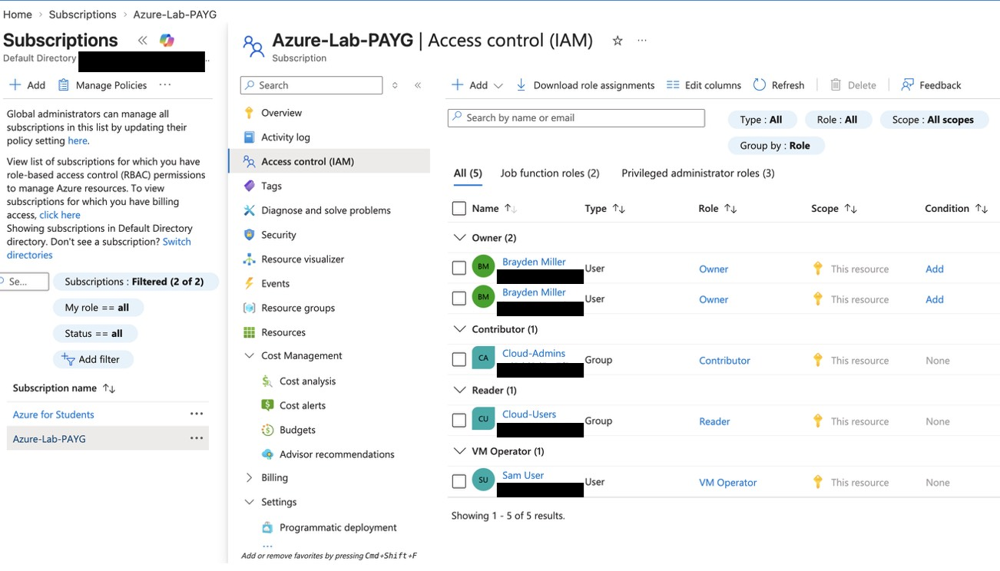
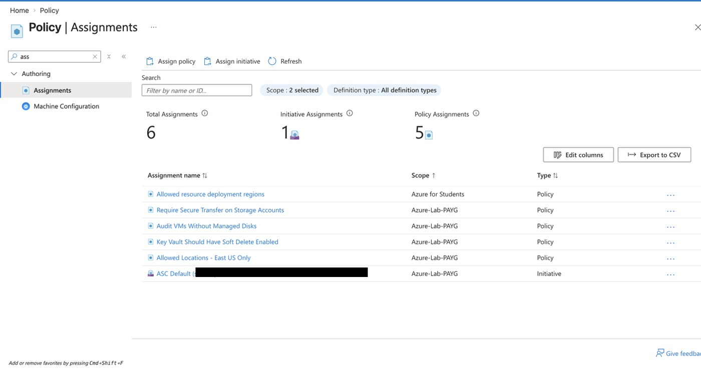
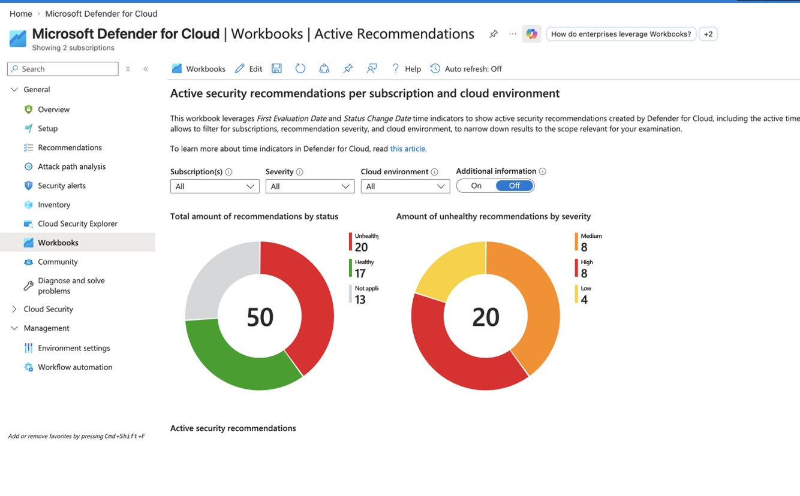

# Azure Identity, Access Management & Security Governance


## Overview

A comprehensive Azure identity and access management lab demonstrating real-world implementation of user and group management, Role-Based Access Control, custom role definitions, Azure Policy enforcement, and security posture management using Microsoft Defender for Cloud. This project mirrors enterprise-grade identity governance and security controls.

## Technologies Used

- Microsoft Azure
- Microsoft Entra ID (Azure Active Directory)
- Role-Based Access Control (RBAC)
- Azure Policy
- Microsoft Defender for Cloud
- Azure CLI (PowerShell)
- Custom Role Definitions

## Architecture

```
Azure Tenant: <your-tenant-domain>
│
├── Users
│     ├── Alex Admin (alexadmin@<your-tenant-domain>)
│     └── Sam User (samuser@<your-tenant-domain>)
│
├── Security Groups
│     ├── Cloud-Admins
│     │     └── Member: Alex Admin
│     └── Cloud-Users
│           └── Member: Sam User
│
├── RBAC Assignments (Subscription Scope)
│     ├── Cloud-Admins → Contributor
│     ├── Cloud-Users → Reader
│     └── Sam User → VM Operator (Custom Role)
│
├── Custom Role: VM Operator
│     ├── Read all resources
│     ├── Start/Stop/Restart VMs
│     └── Read resource groups
│
├── Azure Policy Assignments
│     ├── Allowed Locations — East US Only
│     ├── Require Secure Transfer on Storage Accounts
│     ├── Audit VMs Without Managed Disks
│     └── Key Vault Should Have Soft Delete Enabled
│
└── Microsoft Defender for Cloud
      ├── Foundational CSPM — Enabled
      ├── Secure Score — 45% baseline
      ├── Email notifications — Configured
      └── Security recommendations — Reviewed and actioned
```
## Implementation Details

### Step 1 — Users and Groups
Created two Azure AD users representing different organizational roles and assigned them to security groups. Established the foundation for group-based access control — the enterprise standard for managing permissions at scale rather than assigning roles to individuals.

**Key decision:** Used security groups rather than direct user assignments so that permissions scale automatically as team members are added or removed.

### Step 2 — RBAC and Custom Roles
Assigned built-in RBAC roles to security groups at the subscription scope — Contributor to Cloud-Admins and Reader to Cloud-Users. Built a custom VM Operator role defining exactly five permissions required to manage VM lifecycle without granting broader access. Verified all role assignments through the Azure CLI.

**Key decision:** Created a custom role rather than using built-in roles to demonstrate least privilege at a granular level — the VM Operator can start and stop VMs but cannot create, delete, or modify any other resources.

### Step 3 — Azure Policy Enforcement
Implemented four Azure Policy assignments enforcing security standards across the subscription. Verified the allowed locations policy by attempting a blocked deployment in West US and confirming it was denied. Documented two recommendations as risk accepted with written justification — demonstrating mature security decision making beyond just fixing everything.

**Key decision:** Used Azure Policy to enforce security controls automatically rather than relying on manual processes — ensuring compliance even when engineers make mistakes.

### Step 4 — Microsoft Defender for Cloud
Enabled and configured Microsoft Defender for Cloud, establishing a security posture baseline of 45%. Reviewed and actioned security recommendations including configuring email notifications for high severity alerts. Exempted recommendations that were already addressed through other controls or accepted as lab scope limitations with documented reasoning. Explored security workbooks for ongoing posture monitoring.

**Key decision:** Selected Foundational CSPM over Defender CSPM — the paid tier adds compliance frameworks and attack path analysis valuable in production but unnecessary for lab scope.

## CLI Command Reference

### Create Users
```bash
az ad user create --display-name "Alex Admin" --user-principal-name alexadmin@<your-tenant-domain> --password "<password>" --force-change-password-next-sign-in false

az ad user create --display-name "Sam User" --user-principal-name samuser@<your-tenant-domain> --password "<password>" --force-change-password-next-sign-in false
```

### Create Security Groups
```bash
az ad group create --display-name "Cloud-Admins" --mail-nickname "Cloud-Admins"

az ad group create --display-name "Cloud-Users" --mail-nickname "Cloud-Users"
```

### Add Members to Groups
```bash
az ad group member add --group "Cloud-Admins" --member-id <alex-admin-object-id>

az ad group member add --group "Cloud-Users" --member-id <sam-user-object-id>
```

### Assign RBAC Roles to Groups
```bash
# Assign Reader to Cloud-Users
az role assignment create --role "Reader" --assignee-object-id <cloud-users-group-id> --assignee-principal-type Group --scope /subscriptions/<sub-id>

# Assign Contributor to Cloud-Admins
az role assignment create --role "Contributor" --assignee-object-id <cloud-admins-group-id> --assignee-principal-type Group --scope /subscriptions/<sub-id>
```

### Create Custom VM Operator Role
```powershell
$customRole = @{
    Name = "VM Operator"
    Description = "Can read resources and start/stop VMs but cannot create or delete"
    Actions = @(
        "Microsoft.Compute/virtualMachines/read",
        "Microsoft.Compute/virtualMachines/start/action",
        "Microsoft.Compute/virtualMachines/deallocate/action",
        "Microsoft.Compute/virtualMachines/restart/action",
        "Microsoft.Resources/subscriptions/resourceGroups/read"
    )
    NotActions = @()
    AssignableScopes = @("/subscriptions/<sub-id>")
}

$customRole | ConvertTo-Json -Depth 5 | Out-File -FilePath "vm-operator-role.json" -Encoding UTF8
az role definition create --role-definition vm-operator-role.json
```

### Assign Custom Role to User
```bash
az role assignment create --role "VM Operator" --assignee-object-id <sam-user-object-id> --assignee-principal-type User --scope /subscriptions/<sub-id>
```

### Assign Azure Policies
```bash
# Allowed locations
az policy assignment create --name "allowed-locations" --display-name "Allowed Locations - East US Only" --policy "e56962a6-4747-49cd-b67b-bf8b01975c4c" --params '{"listOfAllowedLocations":{"value":["eastus"]}}' --scope /subscriptions/<sub-id>

# Require secure transfer
az policy assignment create --name "require-secure-transfer" --display-name "Require Secure Transfer on Storage Accounts" --policy "404c3081-a854-4457-ae30-26a93ef643f9" --scope /subscriptions/<sub-id>

# Require managed disks
az policy assignment create --name "require-managed-disks" --display-name "Audit VMs Without Managed Disks" --policy "06a78e20-9358-41c9-923c-fb736d382a4d" --scope /subscriptions/<sub-id>

# Key Vault soft delete
az policy assignment create --name "keyvault-soft-delete" --display-name "Key Vault Should Have Soft Delete Enabled" --policy "1e66c121-a66a-4b1f-9b83-0fd99bf0fc2d" --scope /subscriptions/<sub-id>
```

### Verify Role Assignments
```bash
az role assignment list --scope /subscriptions/<sub-id> --output table
```
## Screenshots

### RBAC Role Assignments


### Azure Policy Assignments


### Microsoft Defender for Cloud


## Security Decisions

| Decision | What Was Used | Production Alternative | Reason Not Used |
|---|---|---|---|
| Access assignment | Group-based RBAC | Same | Best practice at any scale |
| Admin permissions | Contributor role | Owner role | Owner allows permission changes — unnecessary for lab |
| VM management | Custom VM Operator role | Built-in roles | Demonstrates least privilege at granular level |
| Policy enforcement | Azure Policy | Manual processes | Automated enforcement scales better than human checklists |
| Security posture | Foundational CSPM | Defender CSPM | Paid tier unnecessary for lab scope |
| Privileged access | Standard role assignments | Privileged Identity Management | Requires Entra ID P2 licensing |
| Conditional access | Not implemented | Conditional Access policies | Requires Entra ID P2 licensing |

## What I Would Add in Production

- **Privileged Identity Management (PIM)** — just-in-time access for all admin roles, eliminating permanent elevated permissions
- **Conditional Access policies** — require MFA for all users, block access from risky locations, enforce compliant devices
- **Microsoft Defender for Cloud paid tier** — attack path analysis, regulatory compliance reporting against PCI-DSS and ISO 27001
- **Access reviews** — scheduled quarterly reviews of all role assignments to ensure least privilege is maintained over time
- **Emergency access accounts** — break glass accounts with monitored access for when normal admin accounts are unavailable
- **Identity Protection** — risk-based policies that automatically respond to suspicious sign-in behavior
- **Entitlement management** — self-service access packages so users can request access with automatic approval workflows

## Lessons Learned

- Group-based access control scales far better than individual assignments — adding a new admin means one group membership change, not dozens of role assignments
- Custom roles require careful design — listing only the exact actions needed forces you to deeply understand Azure's permission model
- Azure Policy enforcement happens at deployment time — policies cannot fix existing non-compliant resources, only prevent new ones
- Risk acceptance is a legitimate security decision — not every recommendation needs to be remediated, but every decision needs to be documented
- Entra ID P2 features like PIM and Conditional Access require organizational licensing — personal tenant limitations are a real world constraint worth understanding

## Author

**Brayden Miller**
[LinkedIn](https://www.linkedin.com/in/brayden-miller13/) | [GitHub](https://github.com/BraydenMiller-CloudSec)

---
*Built as part of a hands-on Azure cloud security portfolio. See my other projects on GitHub.*
